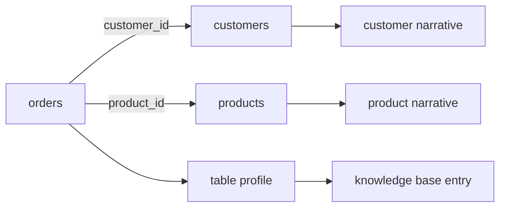

# The newer AI layer

These packages sit on top of the more traditional Hudson stack.

- `higpt` is the foundation.
- `higrate` is about profiling and knowledge-base generation.
- `hidrogen` is about agentic workflows.
- `hipilot` is the RStudio-side productivity layer.

## `higpt`: the foundation layer

If you only learn one AI package well, learn `higpt`.

It is the main LLM interface package for the ecosystem and supports:

- chat
- tool calling
- structured outputs
- embeddings
- image and audio workflows
- multiple providers

### Minimal example

```{r}
#| eval: false
library(higpt)

Sys.setenv(OPENAI_API_KEY = "sk-...")

reply <- higpt::continue_chat(
  data.frame(role = "user", content = "Summarise why primary keys matter in data quality."),
  model_name = "gpt-5-mini",
  reasoning_effort = "minimal"
)

cat(reply)
```

### Tool-calling example

```{r}
#| eval: false
tool <- higpt::new_tool_function(
  name = "add_numbers",
  description = "Add two numbers.",
  parameters = list(
    type = "object",
    properties = list(
      a = list(type = "number"),
      b = list(type = "number")
    ),
    required = list("a", "b")
  )
)

handlers <- list(
  add_numbers = function(args) as.character(args$a + args$b)
)

higpt::chat_with_tools(
  chat_messages = data.frame(role = "user", content = "What is 12 + 30?"),
  tools = list(tool),
  tool_handlers = handlers,
  model_name = "gpt-5-mini",
  reasoning_effort = "minimal"
)
```

### Try it

This exercise needs an API key.

1. Ask `higpt` to summarise a messy business question.
2. Ask it again, but require a structured JSON-like output.
3. Compare the two answers. Which would be easier to plug into a real workflow?

### Stretch

Create a tiny tool that returns:

- the number of rows in a data frame
- the column names
- the first two rows

Then ask the model to profile a toy table by calling your tool.

## `higrate`: from data frames to reusable knowledge

`higrate` is one of the most interesting newer packages because it connects
classic data profiling with AI-generated narratives and relationship discovery.

### The core move

Take in-memory tables and turn them into:

- candidate keys
- summary statistics
- relationship suggestions
- reusable knowledge-base entries

### Example with no LLM requirement

```{r}
#| eval: false
library(higrate)

orders_desc <- higrate::generate_table_description(
  orders_dirty,
  table_name = "orders",
  use_llm = FALSE,
  use_llm_columns = FALSE
)

customers <- data.frame(
  customer_id = c("C001", "C002", "C003"),
  segment = c("retail", "retail", "wholesale"),
  region = c("Gauteng", "Western Cape", "KZN")
)

customers_desc <- higrate::generate_table_description(
  customers,
  table_name = "customers",
  use_llm = FALSE,
  use_llm_columns = FALSE
)

rel <- higrate::generate_relationships(
  orders_desc,
  customers_desc,
  use_llm = FALSE
)

rel$proposed_relationships
```

### Relationship thinking



### Try it

1. Build two toy tables with a clear join path.
2. Run `generate_table_description(..., use_llm = FALSE)`.
3. Run `generate_relationships(..., use_llm = FALSE)`.
4. Decide whether the discovered relationship is actually useful.

### Stretch

Choose a real project table pair and design a small knowledge base:

- which tables deserve narratives?
- which relationships matter?
- what would you want a new teammate to learn from the saved KB?

## `hidrogen`: agentic workflows on top of the stack

`hidrogen` is the package to look at when you want orchestrated AI workflows
rather than one-off prompts.

### What to focus on

- `run_data_explorer()` for exploration
- `run_model_explorer()` for model-oriented workflows
- workflow YAML files
- prompt files
- tool registry design

### Example

```{r}
#| eval: false
library(hidrogen)

exploration <- hidrogen::run_data_explorer(mtcars)
exploration$report$executive_summary

model_run <- hidrogen::run_model_explorer(mtcars, target_col = "mpg", n_iterations = 1)
model_run$explanation
```

### Why it matters

`hidrogen` teaches a more important lesson than any one workflow: if you want
AI systems to be dependable, they need structure, tools, and auditable steps.

### Try it

1. Read one prompt file from `hidrogen`.
2. Identify which parts are domain knowledge and which parts are workflow control.
3. Suggest one improvement to make the workflow safer or clearer.

### Stretch

Design a new workflow idea for your team. Example:

- data dictionary builder
- process incident explainer
- first-pass forecast QA agent

Write:

1. the goal
2. the required tools
3. the main failure modes

## `hipilot`: AI inside RStudio

`hipilot` is a practical add-in package, forked from `gptstudio`, that makes
code-writing and code-editing workflows available inside RStudio.

It is best thought of as a convenience layer, not a replacement for package
fluency.

### A good use of `hipilot`

- drafting repetitive code
- editing boilerplate
- fixing small bugs
- exploring hiverse functions quickly

### A bad use of `hipilot`

- asking it to write production code you do not understand
- sending sensitive data in prompts
- using it instead of learning `hiconnect`, `himunge`, or `hiproc`

## Think

Which of these creates more value in practice:

- an LLM that can talk about your data
- or a workflow that turns data knowledge into reusable team memory?
