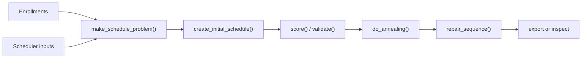

# Two optional packages worth knowing early

Even though they are optional, `hipoint` and `hisched` are interesting enough
that new employees should at least know what they are for.

## `hipoint`: change points and anomalies

`hipoint` is useful when the core question is not "what is the average trend?"
but rather:

- when did the regime change?
- which observations are suspicious?
- should this time series be treated as stable at all?

### The package view

The package exposes:

- `outlier.detect_anomalies()`
- `chpts.detect_changepoints()`

plus several specific methods under the hood.

### Example

```{r}
#| eval: false
library(hipoint)

signal_df <- data.frame(
  date = seq.Date(as.Date("2026-01-01"), by = "day", length.out = 30),
  signal = c(rep(10, 10), rep(18, 10), rep(17, 10))
)

hipoint::chpts.detect_changepoints(
  signal_df,
  index = "date",
  signal = "signal",
  method = "intercept"
)

hipoint::outlier.detect_anomalies(
  signal_df,
  index = "date",
  signal = "signal",
  method = "mad"
)
```

### A visual intuition

```{r}
set.seed(42)
signal_df <- data.frame(
  idx = 1:40,
  signal = c(rnorm(15, mean = 10, sd = 0.8), rnorm(15, mean = 18, sd = 0.8), 32, rnorm(9, mean = 17, sd = 0.8))
)

plot(
  signal_df$idx,
  signal_df$signal,
  type = "b",
  pch = 16,
  col = "#0b6e69",
  xlab = "Index",
  ylab = "Signal",
  main = "A synthetic series with a regime shift and one obvious anomaly"
)
abline(v = 15.5, lty = 2, col = "#a44a1f")
points(31, signal_df$signal[31], pch = 19, col = "#a44a1f", cex = 1.3)
legend(
  "topleft",
  legend = c("Signal", "Candidate changepoint", "Candidate anomaly"),
  col = c("#0b6e69", "#a44a1f", "#a44a1f"),
  lty = c(1, 2, NA),
  pch = c(16, NA, 19),
  bty = "n"
)
```

### Try it

1. Create a series with one level shift and one outlier.
2. Run both `chpts.detect_changepoints()` and `outlier.detect_anomalies()`.
3. Compare whether the methods agree with your visual intuition.

### Stretch

Take a real business metric that should be fairly stable. Ask:

- what counts as drift?
- what counts as a one-off anomaly?
- what should trigger human investigation?

## `hisched`: heuristic scheduling and timetable improvement

`hisched` is optional because it is domain-specific, but it is one of the more
substantial specialist packages in the ecosystem. It is recent, large, and well
tested.

### What it is for

`hisched` helps build and improve schedules, especially in school or timetable
contexts where:

- teacher constraints matter
- student clashes matter
- feasible is not the same as optimal
- fast improvement heuristics are more practical than exact global optimisation

### The package workflow



### Example with the package sample data

```{r}
#| eval: false
library(hisched)

problem <- hisched::make_schedule_problem(
  enrol = hisched::enrol_sample,
  sched_input = hisched::sched_input_sample,
  target_date = as.Date("2026-01-12"),
  school = "IEB",
  phase = "FET"
)

problem <- hisched::create_initial_schedule(problem)
problem <- hisched::score(problem)
problem <- hisched::validate(problem)
```

### Why this package is interesting even if you never schedule timetables

It is a good example of:

- heuristic search
- simulated annealing
- scoring design
- balancing feasibility against improvement

That makes it worth reading as an engineering package, not only a domain package.

### Try it

1. Read the `hisched` README and map the main stages of the algorithm.
2. Load the sample data.
3. Identify which objects are inputs, which are state, and which are outputs.

### Stretch

Suppose a stakeholder says:

"We do not need the globally best schedule. We need a clearly better schedule
by tomorrow, and we need to understand why it improved."

Write a short note explaining why a heuristic package like `hisched` may be a
better fit than a purely exact optimizer.

## Think

What do `hipoint` and `hisched` have in common?

They both help in settings where the real problem is not just prediction. It is
decision support under imperfect structure.
