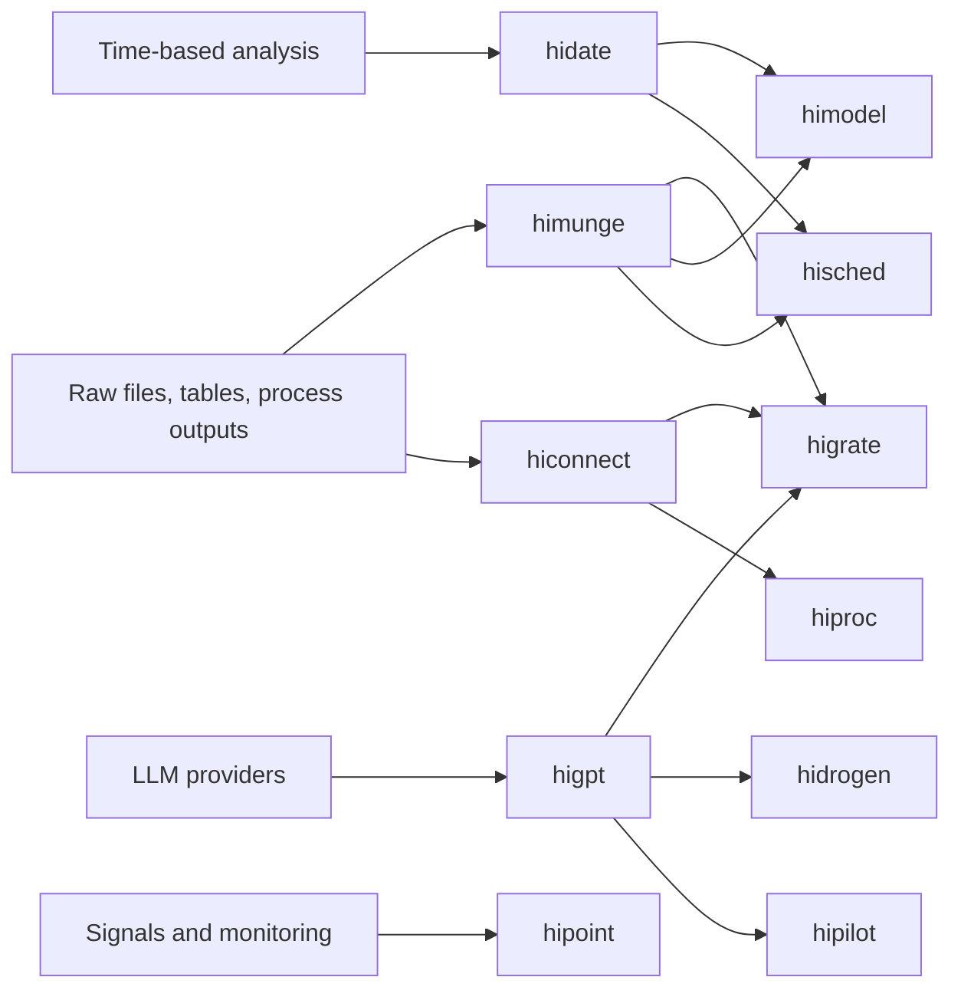

# Why this book?

The Hudson "hiverse" is powerful, but it is not flat. A few packages are
useful almost every week, a few are important for platform work, and a few are
specialist tools that only matter in the right problem domain.

This book is designed as a self-study guide for new Isazi employees. It focuses
on:

- what each important package is for
- when to reach for it
- small examples that show the package in context
- exercises that force you to explore, not just copy code

You do not need to learn every package at once. The recommended path is:

1. Start with `himunge`, `hiconnect`, `hidate`, `hilog`, and the `hiverse` installer.
2. Add `hiproc` if your work touches Hudson processes.
3. Add `higpt`, `higrate`, and `hidrogen` when you want AI-assisted workflows.
4. Add `himodel`, `hipoint`, or `hisched` only when your project needs them.

## The package map

## How to use this book

- Read the overviews quickly.
- Type the examples yourself if you can.
- Do the exercises with your own variations.
- Keep notes on what felt easy, awkward, or surprisingly useful.

Each chapter has a few activities:

- `Try it`: a direct exercise to build fluency.
- `Stretch`: a more open-ended task closer to real project work.
- `Think`: a short reflection prompt about tradeoffs or workflow design.

## What this book assumes

- You can run R locally.
- You have access to GitLab and a personal access token.
- You may or may not have live Hudson database access yet.

Where an exercise needs a live database or an API key, it is marked clearly.
Whenever possible, the examples use small local data frames or package sample
data instead.

## Packages covered

Deep-dive chapters:

- `hiconnect`
- `himunge`
- `hidate`
- `hilog`
- `hiproc`
- `higpt`
- `higrate`
- `hidrogen`
- `himodel`
- `hipoint`
- `hisched`

Supporting package catalog:

- `hiplot`
- `hilog`
- `hifile`
- `hidoc`
- `hidash`
- `himatch`
- `higest`
- `hidalgo`
- `hipilot`

## Suggested study tracks

| Track | Packages | Why start here? |
|---|---|---|
| Core data scientist track | `himunge`, `hiconnect`, `hidate`, `hilog`, `hiproc`, `himodel` | These packages are closest to day-to-day Hudson analysis and platform work. |
| AI-era extension track | `higpt`, `higrate`, `hidrogen`, `hipilot` | These packages add leverage once you already understand the underlying data and workflows. |
| Specialist track | `hipoint`, `hisched` | High-value in the right domain, but not required for every new joiner immediately. |
| Supporting tools track | `hiplot`, `hifile`, `hidoc`, `hidash`, `himatch`, `higest`, `hidalgo` | Useful context and workflow support, but not the best first investment for most people. |

## What success looks like

By the end of the book, a new team member should be able to:

- install the hiverse packages cleanly
- inspect a new dataset and reason about keys, quality, and relationships
- understand the difference between data work, platform work, and AI workflow tooling
- decide which package to reach for before starting a task
- complete one small end-to-end exploration using the Hudson stack
